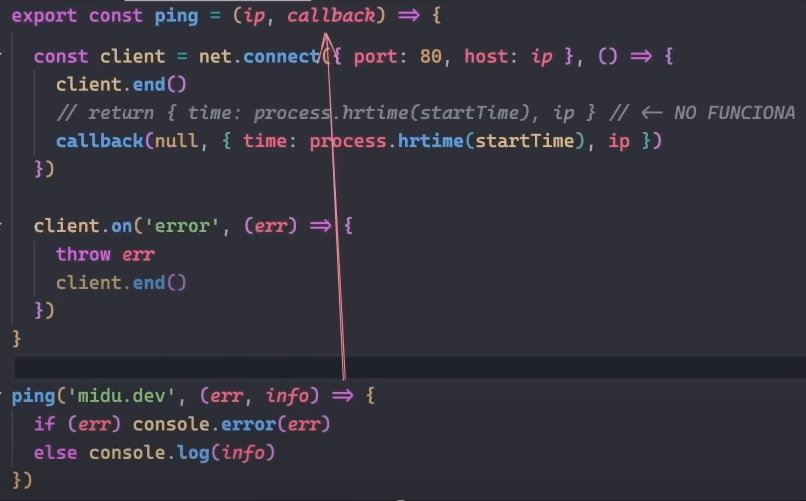

Callbak => Por convección se suele utilizar el primer parámetro del callbak par aindicar el error, y el segundo para pasr la informacion que queremos devolber.

Contig() en este caso tiene que parar el flujo de ejecuicion porque puede llegar a ser undefined, ya que puiede ocuirrris una race condition si es asincrono.-

Race condition = de forma que el proces.env se ejecute antes de que terniem config(), ya que dotenv es lo primero que se carga.